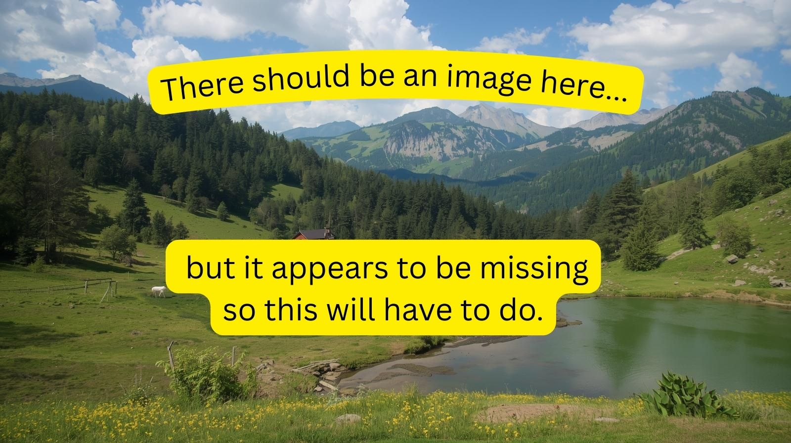

<picture>
 <source media="(prefers-color-scheme: dark)" srcset="./images/hp-profile.jpg">
 <source media="(prefers-color-scheme: light)" srcset="./images/hp-bright.jpg">
 
</picture>

## About me

🇳🇿 born and raised (not really).
3 :joy_cat:, 2 :dog: and a passion for :computer:

<!-- Add more video games later and fix the banner image -->

Read Herodotus for his is a noble vocation that has long been the champion of democracy and the bane of tyrants.

Best Video Games All Time 

| **Rank** | **Game**                   | **Hours Played** |
|:---------|:---------------------------|:-----------------|
|     1    | XCOM 2                     | 1455             |
|     2    | The Witcher 3: Wild Hunt   | 1254             |
|     3    | The Elder Scrolls V: Skyrim| 1224             |
|     4    | Fallout 4                  | 2223             |
|     5    | Cyberpunk 2077             | 457              |

---
>Circumstances rule men; men do not rule circumstances — Herodotus
